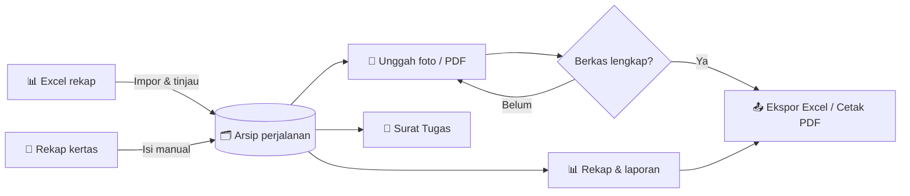
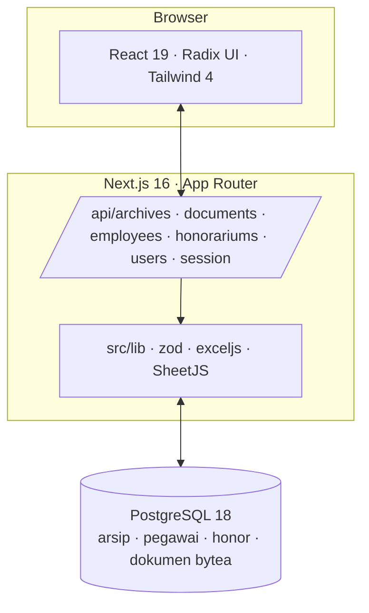

<div align="center">


# Arsip Perjalanan

**Buku register digital untuk perjalanan dinas, surat tugas, honorarium, dan berkasnya.**<br>
Dibangun untuk Dinas Energi dan Sumber Daya Mineral Provinsi Jambi.

[](https://nextjs.org)
[](https://react.dev)
[](https://www.typescriptlang.org)
[](https://www.postgresql.org)
[](https://railway.com)
[](https://nodejs.org)

[Mulai cepat](#-mulai-cepat) · [Fitur](#-apa-yang-bisa-dilakukan) · [Alur kerja](#-alur-kerja) · [Arsitektur](#-di-balik-layar) · [Deploy](#-deploy-ke-railway) · [Panduan lengkap](docs/panduan-operasional.md)

</div>

---

## 📖 Cerita singkat

Setiap tahun, ratusan perjalanan dinas selesai dilaksanakan. Rekapnya tersebar di file Excel, foto kuitansi di ponsel, dan map kertas di lemari arsip. Ketika ada pemeriksaan, orang harus mencari satu per satu.

**Arsip Perjalanan** mengumpulkan semuanya ke satu tempat. Tampilannya sengaja dibuat seperti buku register: satu lembar putih, tab tahun di punggungnya, dan setiap baris bisa dibuka untuk melihat rinciannya. Data historis dianggap benar apa adanya. Tidak ada alur persetujuan perjalanan baru dan tidak ada tarif yang diterapkan ulang ke biaya lama.

> Aplikasi ini mencatat perjalanan yang **sudah dilaksanakan**. Ia adalah arsip, bukan sistem pengajuan.

---

## ✨ Apa yang bisa dilakukan

| Menu | Untuk apa |
|---|---|
| 🗂️ **Arsip perjalanan** | Register utama. Satu baris per surat tugas, bisa dibuka untuk melihat setiap pegawai, SPPD, biaya, dan dokumennya. |
| 📄 **Surat Tugas** | Agenda surat tugas per bulan dalam angka Romawi I sampai XII, lengkap dengan roster pegawai dan total biaya per surat. |
| 💰 **Honorarium** | Buku honor per tahun anggaran: pengelola keuangan, pengadaan, UKPBJ, dan BMD. Bruto, pajak, dan netto dihitung otomatis. |
| 📊 **Rekap & laporan** | Ringkasan realisasi per tahun, bidang, dan bulan. Ekspor Excel mengikuti filter yang sedang aktif. |
| 📁 **Dokumen** | Matriks kelengkapan berkas. Sekali lihat langsung tahu map mana yang masih kurang foto SPPD atau laporannya. |
| 👥 **Pegawai** | Direktori pegawai dengan NIP, jabatan, golongan, dan bidang. Menjadi sumber isian saat membuat arsip baru. |
| ⚙️ **Pengaturan** | Kelola bidang dan akun operator. Administrator dibuat sekali dari variabel lingkungan. |

<details>
<summary><b>🧾 Impor Excel yang mengerti format kantor</b></summary>
<br>

Format **Rekap perjalanan dinas per pegawai** dikenali otomatis. Baris lanjutan biaya digabungkan ke pegawai yang benar, sel gabungan mengikuti sumber, dan rumus yang merujuk pegawai lain ditandai untuk ditinjau. Untuk format umum, baris judul kolom dideteksi sendiri dan pemetaan kolom bisa diperiksa sebelum disimpan.

- Menerima XLSX, XLS, dan CSV sampai 20 MB, maksimal 1.000 entri per impor.
- Pratinjau dulu, simpan belakangan. File sumber tidak pernah diubah.
- NIP yang sama dengan nama berbeda tidak dibuang diam-diam, tetapi diberi catatan pemeriksaan.

</details>

<details>
<summary><b>✍️ Isi manual untuk satu atau banyak pegawai sekaligus</b></summary>
<br>

Isi perjalanan sekali, pilih pegawai lewat pencarian, lalu lengkapi SPPD dan biaya masing-masing. Bagian Penginapan, Kendaraan/BBM, Penerbangan, dan Biaya lain tetap terbuka saat berpindah orang. **Salin biaya** memperlihatkan komponen dan penerimanya sebelum diterapkan.

- Bukti hotel, kendaraan, dan tiket bisa dipakai untuk mengganti nominal komponen tanpa dijumlahkan dua kali.
- Uang harian ke luar Provinsi Jambi otomatis memakai tarif provinsi tujuan sesuai Perpres 72/2025.
- Semua pegawai dalam satu surat tugas disimpan dalam satu transaksi. Ada duplikat, seluruh kelompok dibatalkan.

</details>

<details>
<summary><b>📤 Ekspor Excel dan cetak yang siap diserahkan</b></summary>
<br>

Hasil Excel berkop dinas dengan judul di tengah, judul kolom berkelompok, baris jumlah, panel beku, dan pengaturan cetak. Lembar rekap, rincian biaya, dan daftar dokumen dipisahkan. Perjalanan dalam dan luar provinsi mendapat lembar sumber masing-masing. Ringkasan per arsip juga bisa dicetak atau disimpan sebagai PDF dari browser.

</details>

<details>
<summary><b>🛡️ Aman untuk dipakai bersama</b></summary>
<br>

- Setiap perubahan memeriksa versi, jadi pekerjaan operator lain tidak tertimpa.
- Koreksi arsip memerlukan alasan dan tercatat dalam riwayat.
- Arsip yang dihapus masuk **Sampah** dan bisa dipulihkan bersama dokumen serta riwayatnya.
- Ruang contoh dan ruang kantor terpisah total, termasuk untuk unduhan lampiran.

</details>

---

## 🔄 Alur kerja



1. **Masuk** dengan akun operator atau administrator.
2. **Impor** file Excel atau **tambah arsip** dari rekap kertas.
3. **Tinjau** catatan tanggal, rumus, dan identitas sebelum menyimpan.
4. **Lengkapi** map dengan foto SPPD, kuitansi, dan laporan.
5. **Ekspor** atau **cetak** sesuai filter tahun, bidang, dan bulan.

---

## 🚀 Mulai cepat

Butuh **Node.js 24** dan sebuah database **PostgreSQL** yang bisa dijangkau.

```bash
git clone https://github.com/bbreezyX/arsipesdm.git
cd arsipesdm
npm ci
cp .env.example .env.local
```

Isi `.env.local`:

| Variabel | Wajib | Keterangan |
|---|:---:|---|
| `DATABASE_URL` | ✅ | URL koneksi PostgreSQL. Tabel dibuat otomatis saat pertama jalan. |
| `ADMIN_EMAIL` | ✅ | Email administrator pertama. |
| `ADMIN_PASSWORD` | ✅ | Hanya dipakai saat database masih kosong. Mengubahnya kemudian tidak mengganti sandi yang sudah ada. |
| `DEMO_ENABLED` | | `true` untuk mengaktifkan ruang contoh berisi data fiktif. |
| `APP_ORIGIN` | | URL publik aplikasi, misalnya `https://arsipesdm.up.railway.app`. |
| `TEST_DATABASE_URL` | | Database terpisah untuk uji integrasi. Setiap uji memakai schema `test_*` sekali pakai. |

Lalu jalankan:

```bash
npm run dev
```

Buka **http://127.0.0.1:3107** dan masuk dengan akun administrator dari `.env.local`.

<details>
<summary><b>Perintah lain</b></summary>
<br>

| Perintah | Fungsi |
|---|---|
| `npm run build` lalu `npm start` | Jalankan hasil build produksi di `0.0.0.0:$PORT`. |
| `npm run typecheck` | Pemeriksaan tipe TypeScript. |
| `npm test` | Unit test dan uji integrasi database. |
| `node --env-file=.env.local scripts/integration.mjs` | Uji HTTP terhadap server yang sedang berjalan. |
| `node --env-file=.env.local scripts/backup-postgres.mjs backups/<nama>.json` | Backup JSON konsisten, lampiran disertakan. |

</details>

---

## ☁️ Deploy ke Railway

Repositori ini sudah membawa `railway.json`. Cukup buat satu service dari repo dan satu service PostgreSQL, lalu sambungkan:

```
DATABASE_URL = ${{Postgres.DATABASE_URL}}
```

Railway akan menjalankan `npm run build`, memulai dengan `npm start`, dan memeriksa kesehatan lewat `/api/health`. Berikan volume persisten pada PostgreSQL, dan pastikan backup terjadwal dengan `pg_dump --format=custom` karena lampiran juga tersimpan di database.

---

## 🧠 Di balik layar



| Lapisan | Pilihan | Kenapa |
|---|---|---|
| Kerangka | Next.js 16 App Router, React 19 | Satu codebase untuk halaman dan API, rendering server untuk halaman cetak. |
| Bahasa | TypeScript 5.9 + zod 4 | Setiap payload arsip divalidasi ketat sebelum masuk database. |
| Tampilan | Tailwind CSS 4, Radix UI, lucide-react | Komponen aksesibel dengan gaya buku register yang konsisten. |
| Data | PostgreSQL via `pg` | Transaksi atomik, advisory lock untuk penomoran, lampiran sebagai `bytea` maksimal 10 MB. |
| Excel | exceljs untuk ekspor, SheetJS untuk impor | Ekspor berkop dan berformat, impor toleran terhadap sel gabungan dan rumus. |
| Tipografi | Instrument Sans Variable | Satu keluarga, dua suara: lebar normal untuk teks, condensed untuk angka dan tab tahun. |

<details>
<summary><b>Struktur folder</b></summary>
<br>

```
src/
├── app/
│   ├── [section]/        # Halaman utama: arsip, surat tugas, honorarium, dokumen, pegawai, pengaturan
│   ├── api/              # Route handler REST
│   ├── cetak/[id]/       # Ringkasan cetak per arsip
│   ├── globals.css       # Fondasi tampilan
│   └── *.css             # Satu berkas gaya per register (arsip, surat-tugas, honorarium, dokumen, ...)
├── components/           # Komponen React per fitur
└── lib/                  # Model, validasi, impor/ekspor Excel, akses database, dan unit test
scripts/                  # Backup, migrasi, dan uji integrasi
docs/                     # Panduan operasional dan catatan desain
```

</details>

<details>
<summary><b>Ringkasan API</b></summary>
<br>

Semua endpoint memerlukan sesi login dan bekerja di dalam ruang kerja pengguna. Sesi berakhir setelah 30 menit tanpa aktivitas atau 24 jam sejak masuk; browser menampilkan peringatan 2 menit sebelumnya.

| Endpoint | Metode | Keterangan |
|---|---|---|
| `/api/session` | `POST` `DELETE` `GET` `PATCH` | Masuk, keluar, status sisa waktu sesi (tanpa memperpanjang), dan perpanjangan batas tidak aktif. |
| `/api/archives` | `GET` `POST` | Daftar dan buat arsip. |
| `/api/archives/:id` | `GET` `PATCH` `DELETE` | Detail, koreksi dengan alasan, hapus dengan pemeriksaan versi. |
| `/api/archives/batch` | `POST` | Simpan beberapa pegawai dalam satu transaksi. |
| `/api/archives/import` | `POST` | Simpan baris hasil pratinjau impor Excel, maksimal 1.000 entri. |
| `/api/documents` `/api/documents/:id` | `POST` `GET` `DELETE` | Lampiran PDF, JPG, PNG. |
| `/api/employees` `/api/employees/:id` | `GET` `POST` `PATCH` `DELETE` | Direktori pegawai. |
| `/api/honorariums` `/api/honorariums/:id` | `GET` `POST` `PATCH` `DELETE` | Buku honor. |
| `/api/users` | `GET` `POST` | Akun operator, khusus administrator. |
| `/api/settings` | `PATCH` | Daftar bidang. |
| `/api/health` | `GET` | Cek koneksi database untuk pemantau. |

</details>

---

## 🎨 Bahasa visual

Satu buku register: kanvas abu lembut, lembar putih, sidebar navy yang diambil dari lambang Jambi, dan emas lambang yang hanya dipakai untuk penanda posisi.


Hijau dan amber hanya berarti kelengkapan, tidak pernah dipakai untuk hal lain. Penjelasan lengkapnya ada di [DESIGN.md](DESIGN.md).

---

## 🧪 Pengujian

```bash
npm run typecheck
npm test
```

Uji mencakup tanggal arsip, biaya bersama, kosong versus nol, pemetaan Excel, hasil XLSX, CRUD, konflik versi, duplikat, riwayat, lampiran, pemulihan, login, dan isolasi ruang kerja. Uji database membuat schema `test_*` unik dan menghapusnya sendiri; tabel aplikasi tidak pernah disentuh.

---

## 🧭 Batasan yang perlu diketahui

- Foto dan PDF disimpan sebagai lampiran. Isinya belum dibaca otomatis (belum ada OCR).
- Pemeriksaan duplikat memakai identitas perjalanan. Variasi ejaan nama tetap perlu dilihat operator.
- Ekspor Excel bukan pengganti backup karena tidak memuat lampiran dan akun.

---

## 🙏 Kredit

- Lambang Provinsi Jambi dari [Wikimedia Commons](https://commons.wikimedia.org/wiki/File:Coat_of_arms_of_Jambi.svg), domain publik.
- Tarif uang harian luar provinsi mengikuti Perpres 72/2025, Lampiran I, Tabel 1.2.

<div align="center">
<sub>Dibuat untuk Dinas ESDM Provinsi Jambi. Panduan operasional lengkap ada di <a href="docs/panduan-operasional.md">docs/panduan-operasional.md</a>.</sub>
</div>
